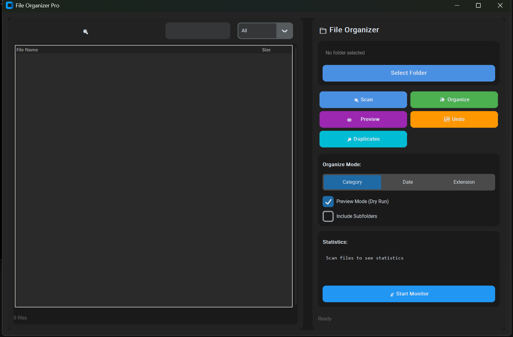

# AutoFileOrganizer

📁 **Smart file organizer desktop app** - Automatically organize messy folders into categorized subfolders with a modern UI.

## ✨ Features

- **🔍 Auto-detect Files** - Scan and detect all files in any folder
- **🏷️ Smart Categorization** - Auto-sort by type (Images, Documents, Videos, Music, Archives, Code, etc.)
- **📂 Multiple Organize Modes** - Category, Date, or Extension
- **🌗 Dark/Light Theme** - Toggle between dark and light mode
- **👁️ Preview Mode** - See changes before applying
- **↩️ Undo Support** - Revert last operation anytime
- **🔎 Duplicate Detection** - Find duplicate files by content hash
- **📡 Real-time Monitor** - Watch folder for new files
- **🔍 Search & Filter** - Quick search and category filter
- **📊 Statistics Dashboard** - View file stats at a glance

## 🚀 Quick Start

```bash
# Install dependencies
pip install -r requirements.txt

# Run the app
python main.py
```

Or double-click `run.bat` on Windows.

## 📖 How to Use

1. **Select Folder** - Choose the folder you want to organize
2. **Scan Files** - Click to detect all files
3. **Choose Mode** - Select Category, Date, or Extension
4. **Preview** (optional) - See what will happen
5. **Organize** - Click to move files into folders
6. **Undo** - Made a mistake? Click Undo!

## 📁 File Structure

| File | Description |
|------|-------------|
| `main.py` | Main application with GUI |
| `file_organizer.py` | File scanning & organization logic |
| `undo_manager.py` | Undo/redo functionality |
| `folder_monitor.py` | Real-time folder monitoring |
| `requirements.txt` | Python dependencies |

## 🛠️ Tech Stack

- **Python 3.x**
- **CustomTkinter** - Modern dark UI
- **Watchdog** - Folder monitoring
- **Pillow** - Image processing

## 📸 Screenshots



## 📄 License

MIT License - feel free to use and modify!

---

Made with ❤️ for keeping your files tidy.
